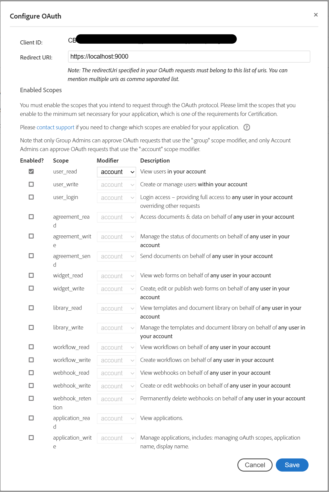
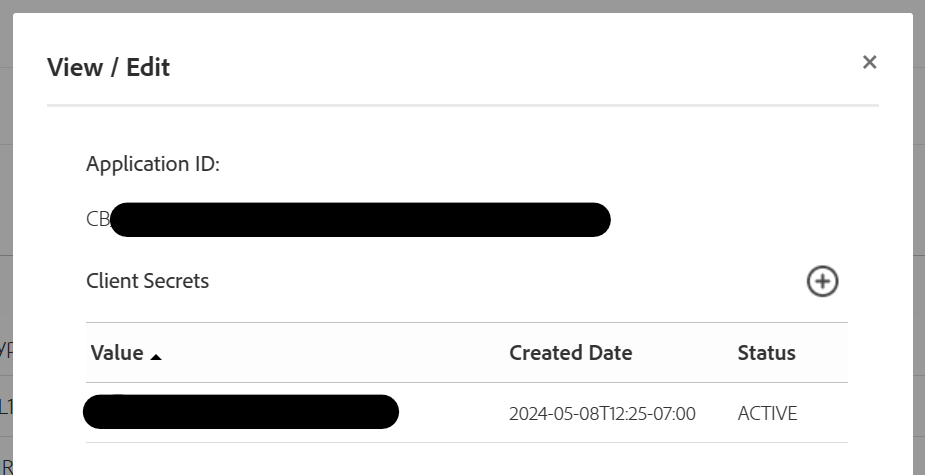
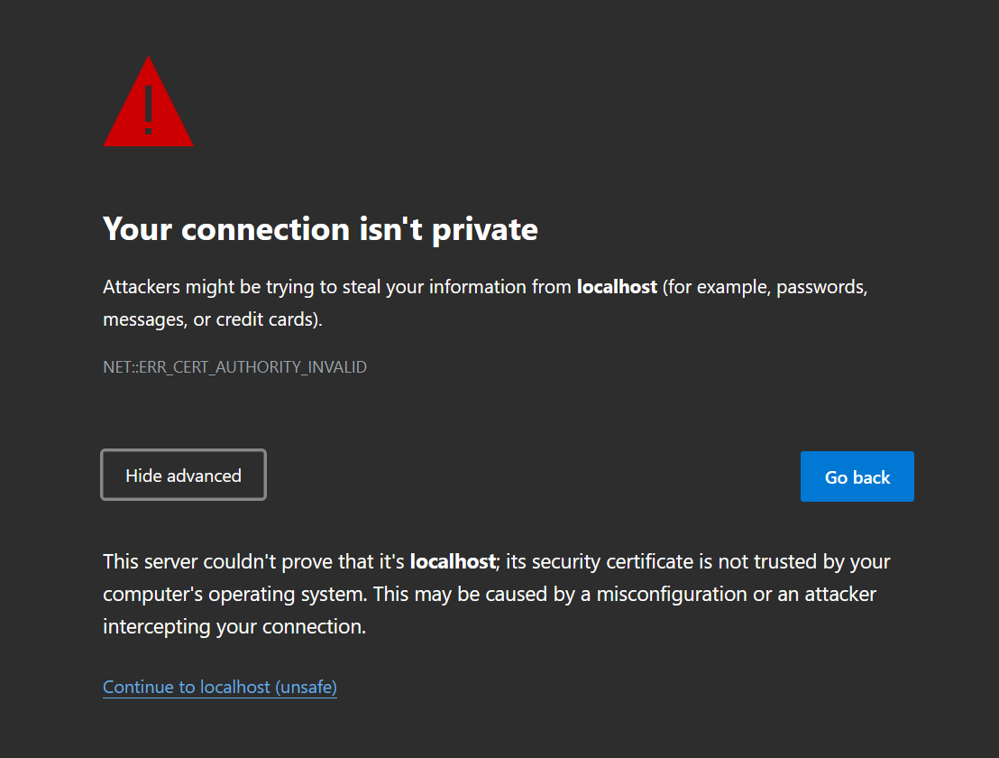
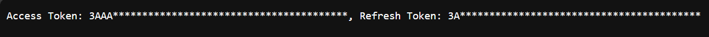

# Adobe Sign Concierge

This is a simple Golang program that assists in getting an access token for Adobe Sign API. It uses the OAuth2.0 authorization code grant flow to get the access token.
The redirect URL is set to `https://localhost:9000` and the authorization code is extracted from the URL.

## Usage

```bash
	go run main.go --clientId *************** \
	--clientSecret *************** \
	--shard na4 --scope "user_read:account"
```

_Note: Replace `clientId`, `clientSecret`, `shard` and `scope` with your own values._
_Scopes is a comma separated list of scopes you want to request._

_Set the Redirect URL in your Adobe Sign application to `https://localhost:9000`._

## Configure Adobe Sign OAuth

Create a new application in Adobe Sign and set the redirect URL to `https://localhost:9000`.
Enable the scopes you need for your application.



Grab the Client Secret from the View/Edit button.


## ERR_CERT_AUTHORITY_INVALID

You will get an SSL Error as the App is running on localhost. You can ignore it and proceed to the URL. The authorization code will be in the URL.



## Response

The response will contain the access token and the refresh token.
It will also be logged in the console

